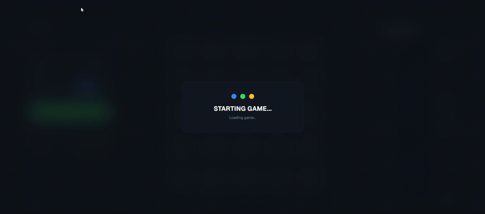

# 💎 Mines Game

A server-driven Mines game built with React, TypeScript, and Zustand. The entire game logic lives on the backend — the frontend never knows where the mines are until the game ends.

> Week 3 Homework · Frontend Bootcamp

---

## Demo



---

## How it works

Players place a bet, choose the number of mines on a 5×5 grid, then reveal cells one by one. Each revealed gem increases the multiplier. Hit a mine — the bet is lost. Cash out at any time to secure the winnings.

- The server places mines randomly and keeps them secret
- The frontend only learns the full board layout after game over or cash out
- Balance and game history are fetched from the server via React Query

---

## Tech Stack

|              |                                     |
| ------------ | ----------------------------------- |
| Framework    | React 19 + TypeScript               |
| Build        | Vite                                |
| State        | Zustand (UI) + React Query (server) |
| Styling      | Tailwind CSS v4 + shadcn/ui         |
| Architecture | Feature-Sliced Design (FSD)         |

---

## Getting Started

### Prerequisites

- Node.js 18+
- npm 9+

### Installation

```bash
git clone https://https://github.com/admitruk237/Mines-Game
cd Mines-Game
npm install
```

### Environment

Create a `.env` file in the project root:

```env
VITE_API_URL=your_api_url_here
```

> Get the API URL from your mentor. Never commit `.env` to git.

### Run

```bash
npm run dev
```

Open [http://localhost:5173](http://localhost:5173)

### Other commands

```bash
npm run build      # production build
npm run test       # run unit tests (watch mode)
npm run test:run   # run tests once
npm run lint       # lint check
```

---

## API Endpoints

All requests include the `X-Player-Id` header (auto-generated and stored in localStorage). A new player with a starting balance of **$10,000** is created automatically on first request.

| Method | Endpoint                 | Description         |
| ------ | ------------------------ | ------------------- |
| `POST` | `/api/games`             | Start a new game    |
| `POST` | `/api/games/:id/reveal`  | Reveal a cell       |
| `POST` | `/api/games/:id/cashout` | Cash out            |
| `GET`  | `/api/games/:id`         | Get game state      |
| `GET`  | `/api/games/active`      | Get active session  |
| `GET`  | `/api/balance`           | Get current balance |
| `GET`  | `/api/history`           | Get game history    |

---

## Project Structure

```
src/
├── app/           # providers, global setup
├── pages/         # page-level composition
├── widgets/       # composite UI blocks
├── features/      # user actions (place-bet, reveal-cell, cash-out...)
├── entities/      # domain models (game, cell, balance, history)
└── shared/        # reusable UI, utils, config, API client
```

Architecture follows [Feature-Sliced Design](https://feature-sliced.design/).

---

## Features

- 5×5 interactive game grid with 6 cell states
- Bet input with quick actions (1/2, ×2, Max)
- Mines count selector (1, 3, 5, 10, 24)
- Real-time multiplier and profit display
- Staggered board reveal animation on game end
- Win / Loss result overlay
- Sound effects with mute toggle
- Game session restore on page reload
- Adaptive layout (375px → 1440px)
- Toast notifications for API errors
